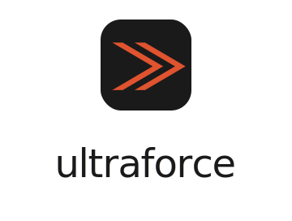

<p align="center">
  
</p>

<p align="center">
  <b>A fast, local-first Salesforce developer desktop toolkit.</b><br>
  Run SOQL, execute anonymous Apex, and read debug logs — with offline,
  IntelliSense-grade code completion for both SOQL and Apex.
</p>

<p align="center">
  <a href="https://github.com/dormonbear/ultraforce-desktop/releases/latest"></a>
  <a href="https://github.com/dormonbear/ultraforce-desktop/releases"></a>
  
  <a href="./LICENSE"></a>
  <a href="https://github.com/dormonbear/ultraforce-desktop/actions/workflows/release.yml"></a>
</p>

<p align="center">
  <a href="#install"><b>Download</b></a> ·
  <a href="#features">Features</a> ·
  <a href="#how-it-works">How it works</a> ·
  <a href="#development">Development</a>
</p>

> **Status:** personal developer tool, actively developed. APIs and UI may change.

## Why Ultraforce

- ⚡ **Local-first & fast.** A native Tauri 2 + Rust desktop app that drives the
  official Salesforce CLI (`sf`) under the hood — it works against any org you
  are already authenticated to, with no extra login.
- 🧠 **Offline IntelliSense.** Context-aware completion for SOQL *and* Apex,
  sourced only from first-party Salesforce endpoints (Tooling API / object
  describes). Index an org once, then complete 100% offline.
- 🔍 **Three core tasks, one window.** SOQL, anonymous Apex, and debug logs —
  the everyday Salesforce-dev loop without a browser tab in sight.

## Install

Download the latest build for your OS from the
[**Releases page**](https://github.com/dormonbear/ultraforce-desktop/releases/latest):

| OS | Download |
| --- | --- |
| **macOS** (Apple Silicon) | `Ultraforce_<ver>_aarch64.dmg` |
| **macOS** (Intel) | `Ultraforce_<ver>_x64.dmg` |
| **Windows** | `Ultraforce_<ver>_x64-setup.exe` or `_x64_en-US.msi` |
| **Linux** | `.AppImage`, `.deb`, or `.rpm` |

The app drives the Salesforce CLI, so install and authenticate
[`sf`](https://developer.salesforce.com/tools/salesforcecli) first
(`sf org login web`).

<details>
<summary><b>First-launch bypass</b> (builds are not paid-code-signed)</summary>

- **macOS** — if you see *"… is damaged and can't be opened"*, clear the download
  quarantine flag, then open normally:
  ```bash
  xattr -cr /Applications/Ultraforce.app
  ```
  On builds that show the milder "unidentified developer" prompt, just
  right-click the app → **Open** → **Open**.
- **Windows** — on the SmartScreen prompt, click **More info → Run anyway**.

</details>

Updates are delivered in-app: Ultraforce checks the Releases page on launch and
offers a one-click download-and-restart when a newer version is available.

## Features

- **SOQL panel** — Monaco editor with context-aware completion (fields, objects,
  relationships, SOQL functions, clause keywords), unknown-field diagnostics from
  live object describes, `TABLE` / `TREE` result views, and an `EXPLAIN` query plan.
- **Anonymous Apex panel** — run anonymous Apex with per-category debug-level
  pickers (a generated `TraceFlag` / `DebugLevel`), jump-to-line compile errors,
  and a colorized debug-log viewer with one-click copy. An optional
  confirm-before-run guard (Settings → Apex) protects against executing DML in
  the wrong org.
- **Apex completion** — member completion over an offline symbol table (OST):
  stdlib namespaces, every org Apex class (full symbol tables), and sObjects
  (fields + relationships) described on demand. Expression-chain inference,
  generic-collection element unwrap, and inheritance/interface flattening.
  Methods insert call snippets with placeholder arguments (and a trailing `;`
  for void statements), pop **signature help** as you fill them in, plus
  constructor completion after `new`, control-flow keyword blocks, and
  bracket / quote auto-closing.
- **Logs panel** — master/detail debug-log viewer with status badges, governor
  limits, and tree / limits / raw tabs, plus a clear hint when the org user
  lacks the permission to read `ApexLog`.
- **Explorer + workspace** — VS Code-style sidebar over real `*.soql` / `*.apex`
  files on disk with keyboard navigation, drag-to-move, and inline rename;
  multi-tab editing with debounced autosave, name and full-text search with
  jump-to-line, and run history.

## How it works

Ultraforce keeps an **offline symbol table (OST)** per org. Index an org once and
completion is served entirely from local data — no per-keystroke network calls.
Re-selecting an org runs an **incremental delta-sync** that refreshes only what
changed (changed classes + sObjects, with deletion reconcile); bulk object
describes use the Composite REST API to keep first-index time down.

All completion and diagnostics data comes from first-party Salesforce endpoints
(Tooling API completions, object describes) — no bundled third-party metadata.

<details>
<summary><b>Architecture</b></summary>

```
crates/
  sf-core/      sf CLI invoker (injectable command runner), org registry, errors
  sf-schema/    object-describe model + on-disk/in-memory cache, Composite REST batch describe
  soql-lang/    SOQL lexer/parser, context-aware completion, field diagnostics
  apex-lang/    Apex symbol model, OST acquisition (stdlib + org classes), snapshot persistence
  log-parser/   debug-log parsing
  features/     orchestration: completion, anonymous Apex, indexing, delta-sync
  uf-ost/       headless indexer + `ultraforce` MCP server (ost_* tools) over the SQLite index
desktop/
  src/          React 19 + Vite + Tailwind v4 + Monaco frontend
  src-tauri/    Tauri 2 shell exposing the Rust features as commands
```

The Rust crates are pure and unit-tested with an injectable command runner, so
the bulk of the logic is testable without a live org. A separate suite of
real-org end-to-end tests (`#[ignore]` by default) runs against an authenticated
dev org.

</details>

## Use your org in your AI agent (MCP)

The same offline index powers an MCP server, so an AI coding agent can ask about
your org's **real** schema and Apex symbols instead of guessing field API names,
inventing picklist values, or triggering the ~145 s live SymbolTable query.

```bash
# Index an org once (headless; also runnable from launchd/cron):
cargo run -p uf-ost -- index --org <alias>

# Then point your agent's MCP config at:
cargo run -p uf-ost -- serve      # stdio; server name "ultraforce"
```

Eight `ost_*` tools: `ost_object`, `ost_field` (cross-org drift), `ost_picklist`,
`ost_apex`, `ost_search` (FTS), `ost_status`, `ost_sync` (synchronous delta), and
`ost_reindex` (async full rebuild). Every response is stamped with the org alias
and the snapshot's age. The bundled [`skills/ost`](skills/ost/SKILL.md) teaches
the retrieval discipline (verify freshness → sync → reindex + fall back to live
`sf`).

- **Storage:** one SQLite `index.db` per org under `<cache>/ultraforce/<alias>/`
  (`$XDG_CACHE_HOME` / `~/.cache` / `%LOCALAPPDATA%`), overridable with `--root`
  or `UF_OST_ROOT`. WAL mode, so the MCP server reads a consistent snapshot while
  a reindex writes.
- **Org IP:** the index contains your org's describe output. It stays local and
  is never committed — treat the cache dir as sensitive.
- **API consumption:** a full reindex pulls ~4–5k object describes plus the heavy
  `ApexClass` SymbolTable query. Prefer `ost_sync` (cheap watermark delta);
  reindex only when staleness is broad.

## Development

**Requirements:** [Rust](https://www.rust-lang.org/tools/install) (stable),
[Node.js](https://nodejs.org/) + [pnpm](https://pnpm.io/), and the
[Salesforce CLI](https://developer.salesforce.com/tools/salesforcecli) (`sf`)
authenticated to at least one org (`sf org login web`).

```bash
# Install frontend dependencies
pnpm -C desktop install

# Run the desktop app (Tauri dev)
pnpm -C desktop tauri dev

# Build the Rust workspace
cargo build --workspace

# Run unit tests, lints, and formatting checks
cargo test --workspace
cargo clippy --all-targets -- -D warnings
cargo fmt --check
pnpm -C desktop test        # vitest
pnpm -C desktop e2e         # Playwright (mocked Tauri IPC)
```

<details>
<summary>Real-org end-to-end tests (opt-in)</summary>

These target the org alias in `UF_E2E_ORG` (default `ultraforce`):

```bash
UF_E2E_ORG=<your-dev-org-alias> \
  cargo test -p features --test real_org_e2e -- --ignored --test-threads=1
```

</details>

## License

[MIT](./LICENSE) © 2026 Dormon Zhou
